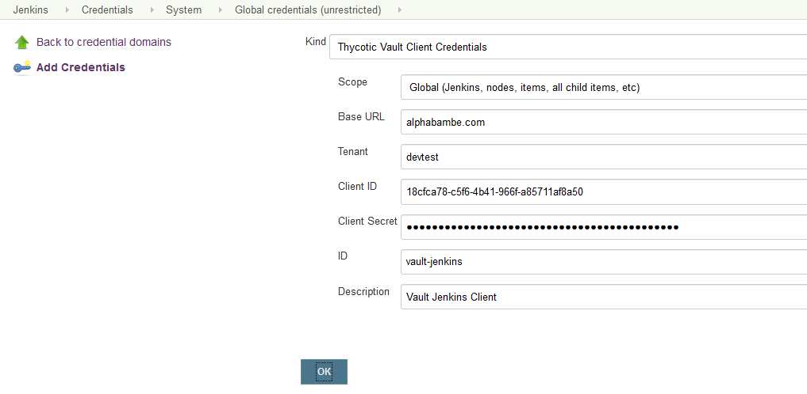
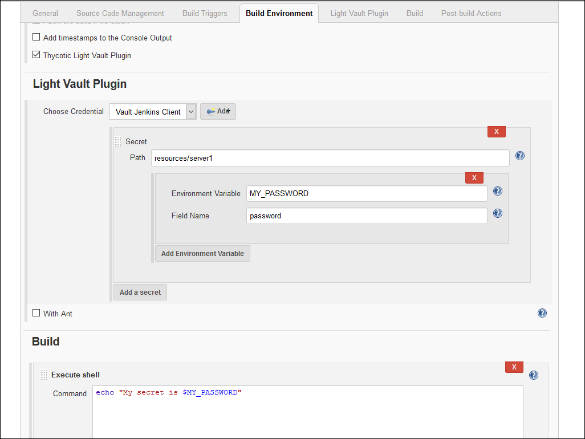
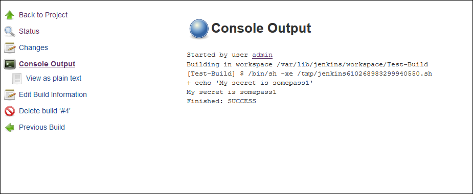
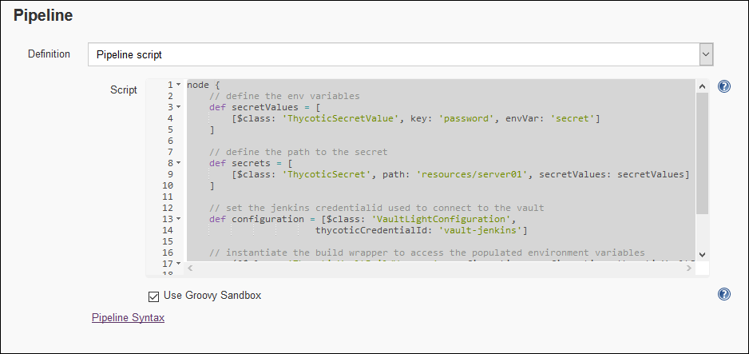

[title]: # (Jenkins)
[tags]: # (DevOps Secrets Vault,DSV,)
[priority]: # (2300)

# Jenkins Extension for DevOps Secrets Vault 

The Jenkins extension allows builds to retrieve secrets from the vault at runtime. It can bind secrets to environment variables through a build step, or by reference in a **jenkinsfile**.

## Obtain

Download the [latest version of the Jenkins HPI extension](https://dsv.thycotic.com/downloads/jenkins/devops-secrets-vault-jenkins.hpi).

## Install

In Jenkins, select **Manage Jenkins > Manage Plugins > Advanced**.

Click **Browse**, locate the **devops-secrets-vault-jenkins.hpi** you downloaded, and bring it into Jenkins.


### Linking Jenkins to DevOps Secrets Vault

Jenkins must be able to query DSV to look up secrets at build time. To enable this,  you configure a Jenkins credential to authenticate to your vault.

#### Setup Client Credentials

Use the DSV CLI to create a new client credential linked to a role that has read permissions on secrets Jenkins will need. 

Example commands for bash:

Create a Role:  

```bash
thy role create --name jenkins --desc "grants access to build secrets"
```

Create a Client Credential:  

```bash
thy client create --role jenkins
```

Save the clientId and clientSecret returned by this command. You will use these to grant Jenkins access to the vault.

Add the Jenkins Role to a Permission Policy:  

```bash
thy config edit -e yaml
```

Here is an example permission document granting the **jenkins** role read-only access to secrets under the resources/path:

```yaml
permissionDocument:
- actions:
  - <.*>
  conditions: {}
  description: Default Admin Policy
  effect: allow
  id: bh516go6kkdc714ojvs0
  meta: null
  resources:
  - <.*>
  subjects:
  - users:<admin>
  - roles:<administrators>
- actions:
  - read
  conditions: {}
  description: Read Policy
  effect: allow
  id: bhm0hnv5725c72kbcv0g
  meta: null
  resources:
  - secrets:resources:<.*>
  subjects:
  - roles:<jenkins>
```

#### Add Newly Created Client Credential in Jenkins

In Jenkins, use these steps to add the newly created client credential:

* Under **Credentials**, add new credentials.


* Enter the vault url, your tenant name, the clientId, and the clientSecret from the newly created client credential.



* You can specify an ID, or skip this step and let Jenkins autogenerate the ID.

### Create a Test Secret

To use secrets from the vault in the Jenkins build pipelines, we need a secret for the jenkins role to access. Note that in the configuration above, the Jenkins role has access to read anything under `resources`. 

We will create a test secret at the path `resources/server01`:

```bash
thy secret create resources/server01 '{"servername":"server01","password":"somepass1"}'
```

Read back the secret to verify the data looks right:

```bash
thy secret read -be JSON resources/server01
```

The resulting JSON secret should look similar to:

```json
{
  "attributes": null,
  "data": {
    "password": "somepass1",
    "servername": "server01"
  },
  "id": "3c679437-9162-4272-8aad-b3cb4ddef4cb",
  "path": "resources:server01"
}
```

During our Jenkins builds, the extension will pull the `password` value of `somepass1` from the `data` property in the secret.

## Freestyle Build

If you prefer not to modify an existing build, create a new item in Jenkins and select **Freestyle project**.

To get credentials in a Freestyle build:

* Under **Build Environment**, mark the **Thycotic Light Vault Plugin** checkbox active.

* Choose the credential previously created. This will authenticate to the vault to get secrets.

* Add a secret and enter:

  * the path to the secret in the vault

  * the environment variable to which you want to bind the secret value

  * the secret data field from which to get the value; in this case we are getting the value from 
    the `password` field of our previously created secret

* In build steps, you can reference the environment variable as you normally would. For example, the shell script shown here will echo the `$MY_PASSWORD` environment variable.
  
---
  

  
---
  
* The console output of the build should show the retrieved secret password value of "somepass1" as expected.
  
---
  

  
---
  
## Jenkinsfile

In a pipeline, you can bind to the extension to get secrets as environment variables.

The secret referenced is the same one created above, so the field value pulled from `password` on the secret would be **somepass1**. 

Set the pipeline script to the following, replacing the `key`, `secret path`, and `thycoticCredentialId` with your values.

```groovy
node {
    // define the env variables
    def secretValues = [
        [$class: 'ThycoticSecretValue', key: 'password', envVar: 'secret']
    ]
    
    // define the path to the secret
    def secrets = [
        [$class: 'ThycoticSecret', path: 'resources/server01', secretValues: secretValues]
    ]

    // set the jenkins credentialid used to connect to the vault
    def configuration = [$class: 'VaultLightConfiguration',
                       thycoticCredentialId: 'vault-jenkins']

    // instantiate the build wrapper to access the populated environment variables
    wrap([$class: 'ThycoticVaultBuildWrapper', configuration: configuration, thycoticVaultSecrets: secrets]) {
        echo "my secret is $secret"
    }
}
```
  
---
  

  
---
  
Running the pipeline, the output will be the password value of the secret from the vault.
  
---
  

  
---
  
As expected, the jenkinsfile outputs the password value from the secret at `resources/server01`.
