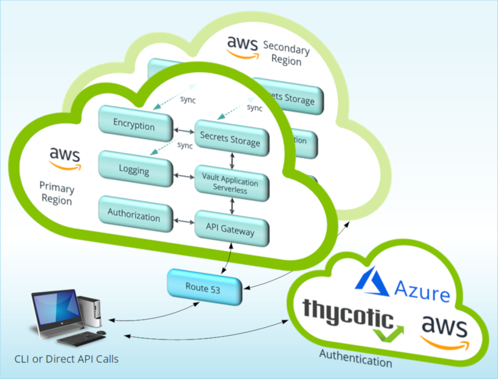

[title]: # (Architecture and Security)
[tags]: # (DevOps Secrets Vault,DSV,)
[priority]: # (7000)

# Architecture and Security

Users authenticate locally or by a Thycotic One, Amazon AWS, or Microsoft Azure authentication provider. 

Within the DSV application platform, the API Gateway receives API calls, obtains the responses, and relays them to the caller using HTTPS GET, PUT, POST and other methods common to the REST architecture. The Authorizer uses OAuth to handle API Gateway authorization.

The Vault Application hosts the core DSV functionality and auto-scales to demand.

Extensive logging enables strong audit trails and protections, while encryption protects Secrets at-rest an in-transit

## Availability
Thycotic architected DSV to support 5-nines (99.999%) uptime. 

## Business Continuity and Disaster Recovery

DevOps Secrets Vault leverages AWS DynamoDB global tables for data storage, with a configuration using automatic dual-region replication as a continuous backup mechanism.

* Of the two AWS Regions used in this architecture, one serves as the primary application platform and the other as a hot stand-by.
* Thycotic monitors both regions via AWS Route 53 so that if the primary platform fails, client traffic automatically routes to the hot stand-by in under one minute.

## Confidentiality

### Data at Rest

Information about customers in DynamoDB, application activity and related logs stored in S3 and sometimes in Elasticsearch during analysis, will always be encrypted transparently.

Customer Secret data is further encrypted by the application with a customer specific key in AWS KMS.

### Data in Transit

DSV establishes the HTTPS connection using the TLS 1.2 protocols. For server-side authentication, DSV relies on Amazon-issued digital certificates.

## Client Authentication

DSV provides five methods for client authentication:

* Username/password (local)
* Username/password (Thycotic One)
* Client ID
* AWS IAM
* Microsoft MSI

Authentication grants an access token with a one-hour time-to-live (TTL). When the token times out, DSV requires re-authentication.

The username/password authentication method uses a refresh token good for 48 hours. The refresh token renews along with each new access token, so the 48 hours counts relative to the last access token’s time of issuance. If the refresh token expires, DSV requires re-authentication.

The initial administrator (the one who signs up for a tenant) is always setup with Thycotic One to enable Thycotic support.

## Integrity Checks

Both code signing and token signing are used to ensure integrity.

### CLI Code Signing

The download website provides a 256-bit hash of the executable files in a text file, so that customers may run a hash check on the downloaded material. The Windows CLI executable is also signed.

### Token Signing

Access tokens granted to Users or applications must transit from the client to the API, potentially allowing an unauthorized party to tamper with the tokens. To prevent this, DSV signs access tokens.

## Personally Identifiable Information (PII) and GDPR

DSV requires certain personally identifiable information (PII) to identify each User’s account. This includes the User’s name, email address, and password, these being the minimum necessary for authentication, and the User’s IP address, used during auditing as an indicator of the User’s location.

DSV functions to store and protect User’s “Secrets,” and to make the Secrets accessible to the User and potentially their designees. The term Secrets here commonly means passwords, which are not PII, but DSV Users can store anything they choose as a Secret—for example, images, documents, or other files.

* Accordingly, only Users know whether DSV Secrets have PII status.

* Because the nature of DSV is to encrypt and protect Secrets for Users, Secrets that are PII will de facto benefit from DSV’s stringent controls for privacy and user control, in accordance with both the letter and spirit of the GDPR.

Only select, trusted employees of Thycotic can access Secrets data and decrypt it, and only via a controlled process that generates an audit trail inaccessible to those employees. This serves the interests of users without compromising their privacy and control.

In GDPR terms, Thycotic customers are the data controllers, and Thycotic is the data processor.

* The customer determines all information (the Secrets) stored in the vault and decides how long to store it.

* Each DSV customer entirely controls their Users, their User Roles, and the access to Secrets by their Users, according to the policies of the customer organization. DSV logs activity so the customer can monitor access and changes to the Secrets, Users, and Roles within the vault—again, all according to the customer’s policies.

* For traceability, DSV logs include source IP addresses and time stamps.

Thycotic conducts a Privacy Impact Assessment (PIA) annually to verify continued conformance to GDPR principles.

### Third Party SOC 2 Conformance Assessment 

The Thycotic SOC 2 Type II report contains an independent third-party assessment of our control environment.  The report is available upon request with an NDA.

The report ties to the AICPA’s Trust Services Criteria (specifically the Security, Availability, and Confidentiality criteria) and issues annually in accordance with the AICPA’s AT Section 101 (Attest Engagements).

  
