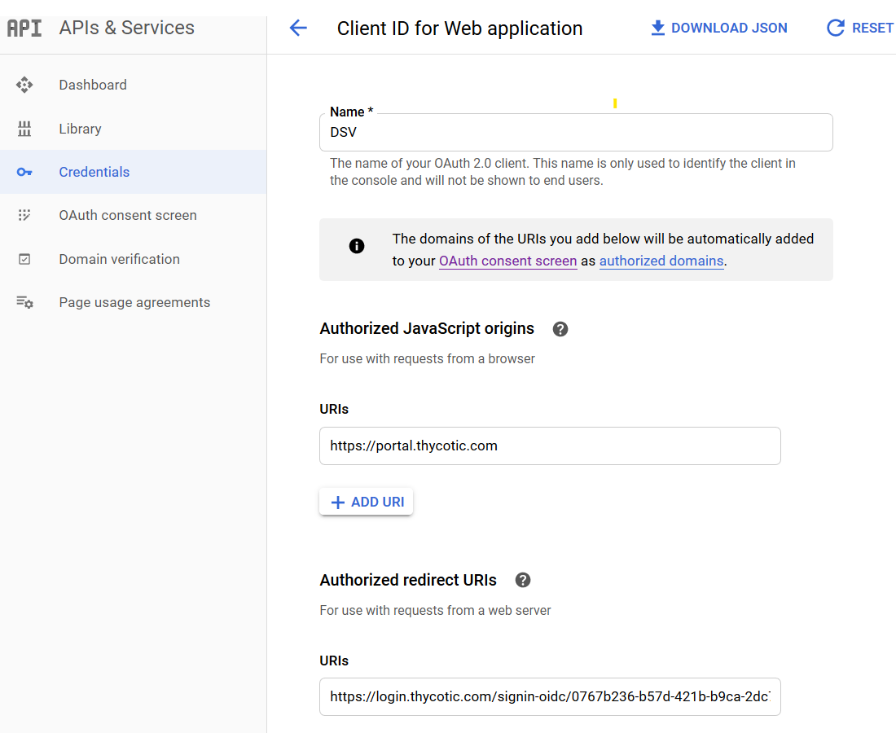

[title]: # (GCP Example)
[tags]: # (DevOps Secrets Vault,DSV,)
[priority]: # (5710)

## Google Identity Provider Example

### Configure Auth Providers

This example uses the Google Cloud Identity service, but the process should be similar for other auth providers.

Sign into the [cloud manager portal](https://portal.thycotic.com) and go to Manage->Teams and click on Organizations for your DSV team.

Click "Auth Providers" and then click the "New" button to create an external auth provider. Copy the Callback URL field. 

1. Go to the [Google Cloud API Console](https://console.cloud.google.com/apis/dashboard) and select a project if needed.

2. Select Credentials and click Create Credentials and click OAuth Client ID.

3. Choose **Web Application**

4. Enter the information, setting the Authorized origin as `https://portal.thycotic.com/` and Authorized redirect as the callback URL copied from the Thycotic cloud manager portal. Follow the instructions to add these URL's to the OAuth consent screen.





5. Save and copy the client id and client secret from the dialog into the credentials create dialog in cloud manager. Your **Provider URL** in cloud manager should be set to `https://accounts.google.com`


6. Save the credential create dialog in cloud manager and go back to Organizations. Click Credentials and then edit your Credential. This is what is used by DSV to connect to the Thycotic One identity provider for authentication. 

7. Verify that there is a **Post-Login** Redirect URI for `http://localhost:8072/callback`. If there isn't, add one. This is the callback used when logging into DSV with the CLI.


### Creating a User

In order to login using OIDC, the user must exist in both the external provider, Thycotic One, and in DSV.

If your current user, such as your initial admin already exists in all places, then skip this section. If you want to add another user do the following steps:

1. In the DSV CLI run `thy user create --username test-user-email@test.com --provider thy-one`

2. This creates a user record in DSV and syncs it to Thycotic One. You can see your users by clicking on the **Users** link from the organization in cloud manager.

### Logging In


Initialize the CLI:

```BASH
thy init
```

Add a new profile if you want to retain your default `thy` profile.

When prompted for the authorization type, choose *OIDC (federated)*.

```BASH
Please enter auth type:
       (1) Password (local user)(default)
       (2) Client Credential
       (3) Thycotic One (federated)
       (4) AWS IAM (federated)
       (5) Azure (federated)
       (6) GCP (federated)
       (7) OIDC (federated)
```

When prompted for the authentication provider hit Enter to accept the default of `thy-one`

If you are on Windows or Mac OS the CLI should automatically open a browser to the Google login page, otherwise it will print out a URL that you can copy and paste into a browser to complete the process.

Login using your Google credentials and your browser will redirect to `http://localhost:8072/callback`, the CLI is listening on that port and will submit the returned authorization code to DSV to finish the login process.

Verify the login by running (omit the --profile flag if you overwrote your config): 

```BASH
thy auth --profile profilename
```


