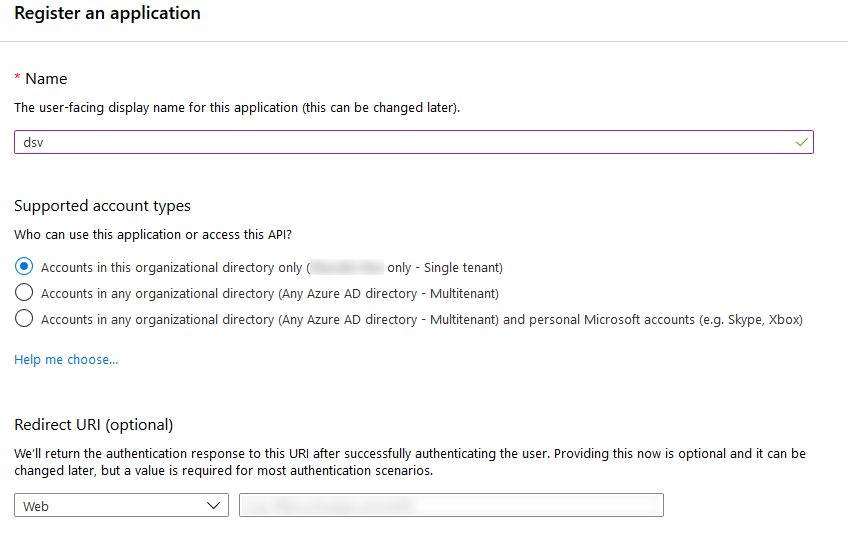
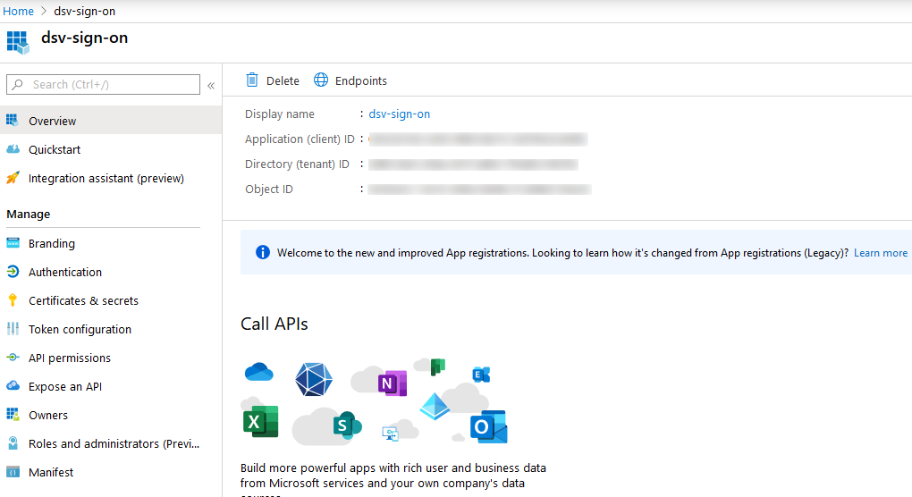

[title]: # (OIDC: Providers)
[tags]: # (DevOps Secrets Vault,DSV,)
[priority]: # (5750)

# OIDC Providers

Any OIDC compliant authentication provider should be configurable to work with Thycotic One and DevOps Secrets Vault. Documented integrations are below.

## Common Steps

For all OIDC authentication providers you will need to get their provider URL, client id, and client secret. You will need to set in the authentication provider the callback URL that it will redirect to once authentication is complete.  

To get your callback URL:

1. Sign into the [cloud manager portal](https://portal.thycotic.com) and go to Manage->Teams and click on Organizations for your team.
2. Click on **Auth Providers** and then click the **New** button. This will open a dialog up. 
3. Give it a name and copy the Callback URL provided. Do not save or cancel, you will be coming back to fill out the rest of the fields.

## Azure AD

1. Get a Callback URL as described above.
2. In your azure portal go to **Azure Active Directory** and then go to the App Registrations.
3. Click **New Registration**
4. Give your app a name and add the Callback URL from Thycotic One as the Redirect URI.

5. Click **Register** to save your app.
6. Go to your app's **Certificates and Secrets**  and click **New Client Secret**
7. Set the time period for the secret and click **Add**. 
8. Copy the client secret, note that it will not be available after you leave the page.
9. Go to **Authentication** and check the box for **ID Tokens** in the implicit grant section and save.
10. Navigate to **Overview** and note the Application ID and Directory ID. The Application ID is your Client ID for Thycotic One and the Directory ID will be part of your provider URL in the format https://login.microsoftonline.com/{directory id}

11. Go back to the open dialog in Thycotic One and enter the Application ID for the Client ID, the generated secret for Client Secret, and fill in the Provider URL and click **Save**
12. When you sign into thycotic one again you should now see an option for logging in with Azure AD. 

