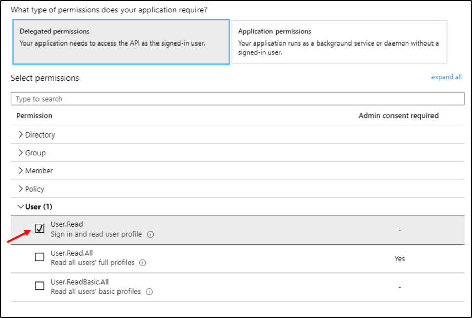
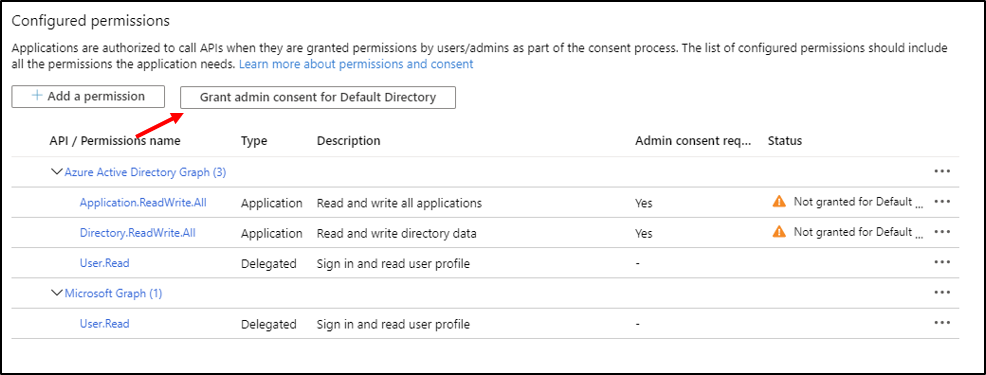
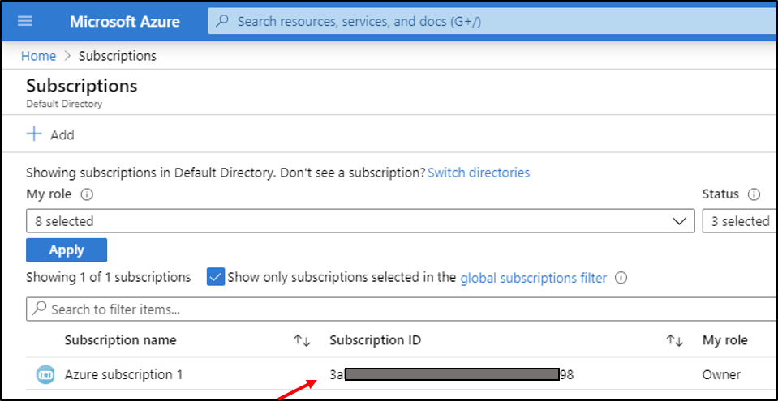

[title]: # (Azure Service Principal)
[tags]: # (DevOps Secrets Vault,DSV,)
[priority]: # (6210)

# Creating an Azure Service Principal

This is a step-by-step guide to creating an Azure service principal with the priviledges necessary to enable Azure credential generation.

An Azure service principal is an identity created for use with applications, hosted services, and automated tools to access Azure resources. 

These are the links to azure documentation on service principal:

* [Service principal](https://docs.microsoft.com/en-us/azure/active-directory/develop/app-objects-and-service-principals)
* [Create Service Principal](https://docs.microsoft.com/en-us/azure/active-directory/develop/howto-create-service-principal-portal)

## Creatig a Service Principal for the DSV Base Secret

1. Go to the [Microsoft Azure portal](https://portal.azure.com) and login.
2. Go to **Azure Active Directory** 
3. Click **App registrations** then **New registration**.  Enter an application name and then click **Register**
4. Take note of the **Application (client) ID** and **Directory (tenant) ID**.  They are the DSV Base secret `clientId` and `tenantId` parameters respectively.

5. Select **Certifications & secrets** then **New client secret**.  Enter a description and how when it should expire.  Click **Add**.

6. Take note of the newly genereated secret which will be the `clientSecret` parameter in the DSV Base Secret.

7. Select **API permissions** and then **Add a permission**.

8. Under Supported Legacy APIs, select **Azure Active Directory Graph**.

9. Select **Delegated permissions**, expand the **User** accordian, and then check the **User.Read** box.

10.  Select **Application permissions** and expand the **Application** and **Directory** accordians.  Check the **Application.ReadWrite.All** and **Directory-ReadWrite.All** boxes

11. Select **Add permisssions** at the bottom of the page.  This takes you back to the API Permissions page.  Notice that the Application permissions have warnings that those permissions are not yet granted.  

12. Click **Grant admin consent for Default Directory** and then **Yes**  This step can be easy to miss.
 

13. Navigate to **Home > Subscriptions** and take note of the **Subscription ID** that you will be using.  This is the `subscriptionId` in the DSV Base Secret.
 

14. Click into the **Subscription ID** then **Access control (IAM)** then **Add** in the **Add role assignment** box on the right.

15. Select **Owner** in the **Role** dropdown.

16. Select **Azure AD user, group, or service principal** in the **Assign access to** dropdown.

17. In the **Select** field, enter the application name or Application (client) ID saved previously and select it so that it shows up under **Selected Members** below.

18.  Click **Save**

