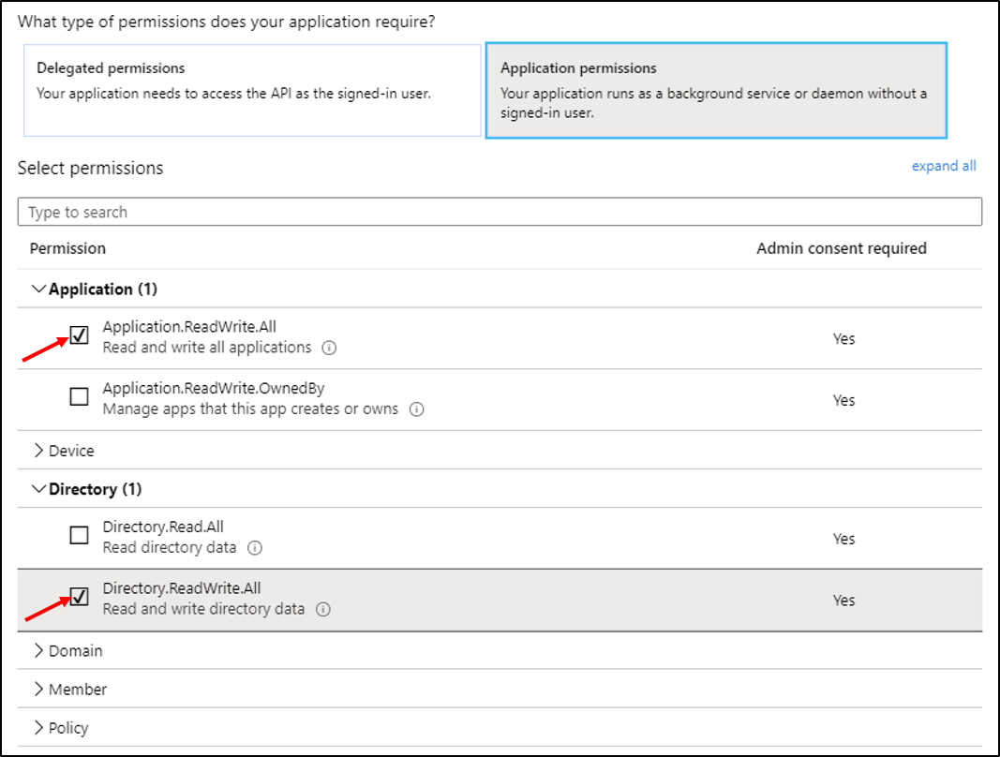

[title]: # (Azure Service Principal)
[tags]: # (DevOps Secrets Vault,DSV,)
[priority]: # (6210)

# Creating an Azure Service Principal

This is a step-by-step guide to creating an Azure service principal with the priviledges necessary to enable Azure credential generation.

An Azure service principal is an identity created for use with applications, hosted services, and automated tools to access Azure resources. 

These are the links to azure documentation on service principal:

* [Service principal](https://docs.microsoft.com/en-us/azure/active-directory/develop/app-objects-and-service-principals)
* [Create Service Principal](https://docs.microsoft.com/en-us/azure/active-directory/develop/howto-create-service-principal-portal)

1. Go to the [Microsoft Azure portal](https://portal.azure.com) and login.
2. Go to **Azure Active Directory** 
3. Take note of the **Tenant ID** which is the `tenantID` field in the DSV Base Secret
4. Click **App registrations** then **New registration**.  Enter an application name and then click **Register**
5. Take note of the **Application (client) ID** and **Directory (tenant) ID**.  They are the DSV Base secret `clientId` and `tenantId` parameters respectively.

6. Select **Certifications & secrets** then **New client secret**.  Enter a description and click **Add**
7. Take note of the newly genereated secret which will be the `clientSecret` parameter in the DSV Base Secret.
8. Select **API permissions** and then **Add a permission**.  Under Supported Legacy APIs, select **Azure Active Directory Graph**