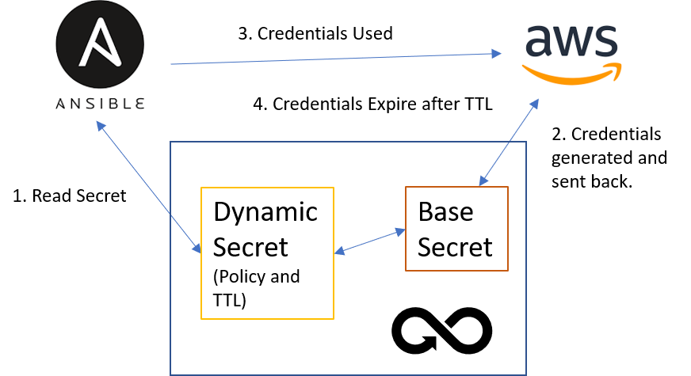

[title]: # (Dynamic Secrets)
[tags]: # (DevOps Secrets Vault,DSV,)
[priority]: # (6000)

# Dynamic Secrets

Dynamic Secrets are Secrets where temporary credentials are generated when the secret is read. This is opposed to a standard Secret where the credentials remain the same until changed by a user. They can be used when you need to provide credentials to a user or resource, like a configuration tool, but the access should expire after a set period of time.

Supported Types:
* AWS
* Azure

## Linking

A Dynamic Secret is linked to a Base Secret, which contains the actual credentials used to generate temporary access keys. 





The linking is done through the `attributes` section in the Secret JSON.  For example the following Secret `temp-api` has no data, but is linked to a different AWS IAM Secret that contains the access and secret key information. The `linkConfig` defines the type of linking and the linked Secret path.


| Attribute                 | Description                                                                                       |
| --------------            | ------------------------------                                                                    |
| linkConfig                | link type and path to the linked Secret.                                                          |
| linkConfig.linkType       | The only valid value is "dynamic"                                                                 |
| linkConfig.linkedSecret   | Secret path to the base credential                                                                |

```json
{
    "id": "cc619722-6538-4891-b0a6-2c7fa1776a67",
    "path": "dynamic:aws:creds:temp-api",
    "attributes": {
        "linkConfig": {
            "linkType": "dynamic",
            "linkedSecret": "base:aws:creds:api-account"
        }
    },
    "description": "",
    "data": {
    }
}
```

## Search for linked Secrets

To get a list of all dynamic secrets linked to a base secret, issue the command `thy secret search --query <base secret path> --search-links`


